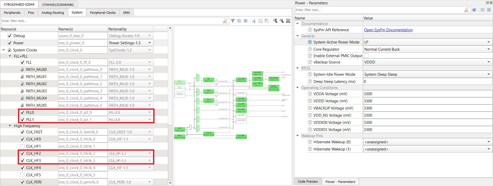
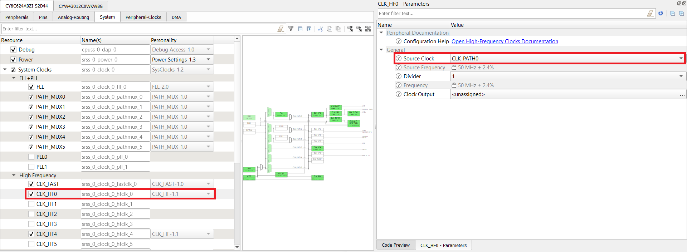
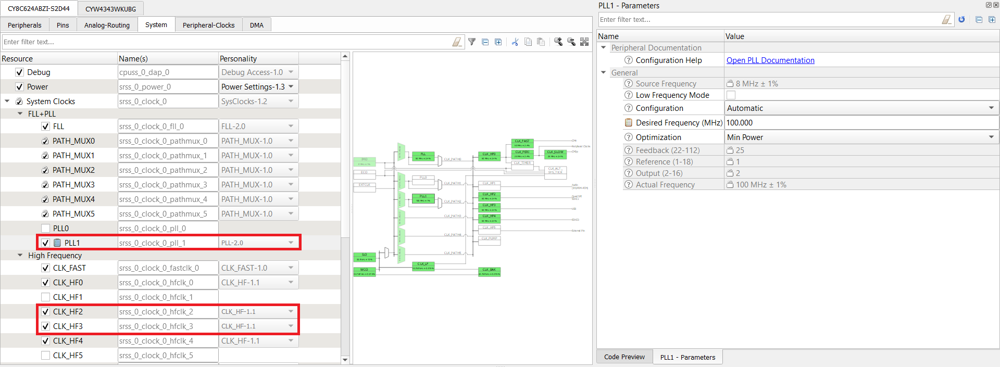
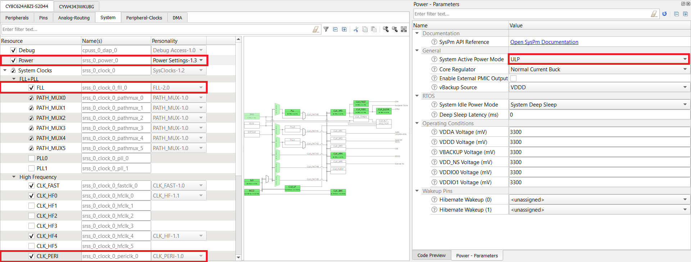
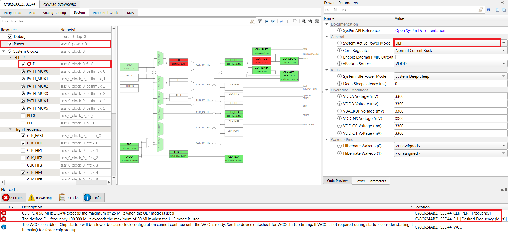

# AnyCloud: WLAN low power

This code example demonstrates the low-power operation of a host MCU and a WLAN device using the network activity handlers provided by the [Low power assistant (LPA) middleware](https://github.com/cypresssemiconductorco/lpa).

The code example connects to a configured network. After connecting to the network successfully, the example configures the WLAN device in a power-save mode, suspends the network stack, and puts the host MCU in a wait state. During this wait state, the host MCU enters a low-power state and wakes up on any network activity detected on the MAC interface.

[Provide feedback on this code example.](https://cypress.co1.qualtrics.com/jfe/form/SV_1NTns53sK2yiljn?Q_EED=eyJVbmlxdWUgRG9jIElkIjoiQ0UyMzAxMDYiLCJTcGVjIE51bWJlciI6IjAwMi0zMDEwNiIsIkRvYyBUaXRsZSI6IkFueUNsb3VkOiBXTEFOIGxvdyBwb3dlciIsInJpZCI6Im11YWEiLCJEb2MgdmVyc2lvbiI6IjIuMi4wIiwiRG9jIExhbmd1YWdlIjoiRW5nbGlzaCIsIkRvYyBEaXZpc2lvbiI6Ik1DRCIsIkRvYyBCVSI6IklDVyIsIkRvYyBGYW1pbHkiOiJQU09DIn0=)

## Requirements

- [ModusToolbox&trade; software](https://www.cypress.com/products/modustoolbox-software-environment) v2.2 or later

    **Note:** This code example version requires ModusToolbox software version 2.2 or later and is not backward compatible with v2.1 or older versions. If you cannot move to ModusToolbox v2.2, use the latest compatible version of this example: [latest-v1.X](https://github.com/cypresssemiconductorco/mtb-example-anycloud-wlan-lowpower/tree/latest-v1.X).
- Board support package (BSP) minimum required version: 2.0.0
- Programming language: C
- Associated parts: All [PSoC&trade; 6 MCU](http://www.cypress.com/PSoC6) parts, [PSoC™ 6 MCU with AIROC™ CYW43012 Wi-Fi & Bluetooth® combo chip](https://www.cypress.com/documentation/datasheets/cyw43012-single-chip-ultra-low-power-ieee-80211n-compliant-ieee-80211ac), [PSoC™ 6 MCU with AIROC™ CYW4343W Wi-Fi & Bluetooth® combo chip](https://www.cypress.com/documentation/datasheets/cyw4343w-single-chip-80211-bgn-macbasebandradio-bluetooth-51)

## Supported toolchains (make variable 'TOOLCHAIN')

- GNU Arm® embedded compiler v9.3.1 (GCC_ARM) - Default value of `TOOLCHAIN`
- IAR C/C++ compiler v8.42.2 (`IAR`)
- Arm compiler v6.13 (`ARM`)

## Supported kits (make variable 'TARGET')

- [PSoC 6 Wi-Fi Bluetooth prototyping kit](https://www.cypress.com/CY8CPROTO-062-4343W) (`CY8CPROTO-062-4343W`) - Default value of `TARGET`
- [PSoC 6 Wi-Fi Bluetooth pioneer kit](https://www.cypress.com/CY8CKIT-062-WiFi-BT) (`CY8CKIT-062-WIFI-BT`)
- [PSoC 62S2 Wi-Fi Bluetooth pioneer kit](https://www.cypress.com/CY8CKIT-062S2-43012) (`CY8CKIT-062S2-43012`)
- [PSoC 62S1 Wi-Fi Bluetooth pioneer kit](https://www.cypress.com/CYW9P62S1-43438EVB-01) (`CYW9P62S1-43438EVB-01`)
- [PSoC 62S1 Wi-Fi Bluetooth pioneer kit](https://www.cypress.com/CYW9P62S1-43012EVB-01) (`CYW9P62S1-43012EVB-01`)
- Rapid IoT Connect developer kit (`CYSBSYSKIT-DEV-01`)

## Hardware Setup

This example uses the board's default configuration. See the kit user guide to ensure that the board is configured correctly.

**Note:** The PSoC 6 Wi-Fi Bluetooth pioneer kit (CY8CKIT-062-WIFI-BT) ships with KitProg2 installed. The ModusToolbox software requires KitProg3. Before using this code example, make sure that the board is upgraded to KitProg3. The tool and instructions are available in the [Firmware Loader](https://github.com/cypresssemiconductorco/Firmware-loader) GitHub repository. If you do not upgrade, you will see an error like "unable to find CMSIS-DAP device" or "KitProg firmware is out of date".

## Software setup

Install a terminal emulator if you don't have one. Instructions in this document use [Tera Term](https://ttssh2.osdn.jp/index.html.en).

This example requires no additional software or tools.

## Using the code example

Create the project and open it using one of the following:

<details><summary><b>In Eclipse IDE for ModusToolbox</b></summary>

1. Click the **New Application** link in the **Quick Panel** (or, use **File** > **New** > **ModusToolbox Application**). This launches the [Project Creator](http://www.cypress.com/ModusToolboxProjectCreator) tool.

2. Pick a kit supported by the code example from the list shown in the **Project Creator - Choose Board Support Package (BSP)** dialog.

   When you select a supported kit, the example is reconfigured automatically to work with the kit. To work with a different supported kit later, use the [Library Manager](https://www.cypress.com/ModusToolboxLibraryManager) to choose the BSP for the supported kit. You can use the Library Manager to select or update the BSP and firmware libraries used in this application. To access the Library Manager, click the link from the **Quick Panel**.

   You can also just start the application creation process again and select a different kit.

   If you want to use the application for a kit not listed here, you may need to update the source files. If the kit does not have the required resources, the application may not work.

3. In the **Project Creator - Select Application** dialog, choose the example by enabling the checkbox.

4. Optionally, change the suggested **New Application Name**.

5. Enter the local path in the **Application(s) Root Path** field to indicate where the application needs to be created.

   Applications that can share libraries can be placed in the same root path.

6. Click **Create** to complete the application creation process.

For more details, see the [Eclipse IDE for ModusToolbox User Guide](https://www.cypress.com/MTBEclipseIDEUserGuide) (locally available at *{ModusToolbox install directory}/ide_{version}/docs/mt_ide_user_guide.pdf*).

</details>

<details><summary><b>In command-line interface (CLI)</b></summary>

ModusToolbox provides the Project Creator as both a GUI tool and a command line tool to easily create one or more ModusToolbox applications. See the "Project Creator Tools" section of the [ModusToolbox User Guide](https://www.cypress.com/ModusToolboxUserGuide) for more details.

Alternatively, you can manually create the application using the following steps:

1. Download and unzip this repository onto your local machine, or clone the repository.

2. Open a CLI terminal and navigate to the application folder.

   On Windows, use the command line "modus-shell" program provided in the ModusToolbox installation instead of a standard Windows command line application. This shell provides access to all ModusToolbox tools. You can access it by typing `modus-shell` in the search box in the Windows menu.

   In Linux and macOS, you can use any terminal application.

   **Note:** The cloned application contains a default BSP file (*TARGET_xxx.mtb*) in the *deps* folder. Use the [Library Manager](https://www.cypress.com/ModusToolboxLibraryManager) (`make modlibs` command) to select and download a different BSP file, if required. If the selected kit does not have the required resources or is not [supported](#supported-kits-make-variable-target), the application may not work.

3. Import the required libraries by executing the `make getlibs` command.

Various CLI tools include a `-h` option that prints help information to the terminal screen about that tool. For more details, see the [ModusToolbox User Guide](https://www.cypress.com/ModusToolboxUserGuide) (locally available at *{ModusToolbox install directory}/docs_{version}/mtb_user_guide.pdf*).

</details>

<details><summary><b>In Third-party IDEs</b></summary>

1. Follow the instructions from the **In command-line interface (CLI)** section to create the application, and import the libraries using the `make getlibs` command.

2. Export the application to a supported IDE using the `make <ide>` command.

   For a list of supported IDEs and more details, see the "Exporting to IDEs" section of the [ModusToolbox User Guide](https://www.cypress.com/ModusToolboxUserGuide) (locally available at *{ModusToolbox install directory}/docs_{version}/mtb_user_guide.pdf*.

3. Follow the instructions displayed in the terminal to create or import the application as an IDE project.

</details>

## Operation

1. Connect the board to your PC using the provided USB cable through the KitProg3 USB connector.

2. Modify `WIFI_SSID`, `WIFI_PASSWORD`, and `WIFI_SECURITY` macros to match with that of the Wi-Fi network credentials that you want to connect to. These macros are defined in the *lowpower_task.h* file.

   **Note:** See the AP's configuration page for the security type. See the `cy_wcm_security_t` enumeration in *cy_wcm.h* to pass the corresponding WCM security type in the `WIFI_SECURITY` macro.

3. Ensure that your computer is connected to the same Wi-Fi access point that you have configured in Step 2.

4. Open a terminal program and select the KitProg3 COM port. Set the serial port parameters to 8N1 and 115200 baud.

3. Program the board using one of the following:

   <details><summary><b>Using Eclipse IDE for ModusToolbox</b></summary>

      1. Select the application project in the Project Explorer.

      2. In the **Quick Panel**, scroll down, and click **\<Application Name> Program (KitProg3_MiniProg4)**.
   </details>

   <details><summary><b>Using CLI</b></summary>

     From the terminal, execute the `make program` command to build and program the application using the default toolchain to the default target. You can specify a target and toolchain manually:
      ```
      make program TARGET=<BSP> TOOLCHAIN=<toolchain>
      ```

      Example:
      ```
      make program TARGET=CY8CPROTO-062-4343W TOOLCHAIN=GCC_ARM
      ```
   </details>

      **Note:** Before building the application, ensure that the *deps* folder contains the BSP file (*TARGET_xxx.lib*) corresponding to the TARGET. Execute the `make getlibs` command to fetch the BSP contents before building the application.

   After programming, the example starts automatically. The example connects to the AP and suspends the network stack.

   **Figure 1. Connect to AP and suspend the network stack**

   

6. Open a command prompt and ping the IP address displayed on the serial terminal:

    ```
    ping <IP address>
    ```

   The network stack is resumed. The device displays the deep sleep and Wi-Fi SDIO bus statistics on the terminal. The LED is toggled after resuming the network stack after which the network stack is again suspended until network activity is detected.

   **Note:** The host MCU will wake up on any network activity and not necessarily due to the ping from the PC. The reasons for network activity could be due to the broadcast or multicast packets issued by the AP. Further power savings can be made by employing offload features like packet filtering, which will increase the time the host MCU will be in deep sleep. See [AN227910 - Low-power system design with CYW43012 and PSoC 6 MCU](https://www.cypress.com/documentation/application-notes/an227910-low-power-system-design-cyw43012-and-psoc-6-mcu) for more details.

    **Figure 2. Resuming the network stack**

    

See [Measuring the current consumption](#measuring-the-current-consumption) for instructions on how to measure the current consumed by the PSoC 6 MCU and the Wi-Fi devices.

## Debugging

You can debug the example to step through the code. In the IDE, use the **\<Application Name> Debug (KitProg3_MiniProg4)** configuration in the **Quick Panel**. For more details, see the "Program and Debug" section in the [Eclipse IDE for ModusToolbox User Guide](https://www.cypress.com/MTBEclipseIDEUserGuide).

**Note:** **(Only while debugging)** On the CM4 CPU, some code in `main()` may execute before the debugger halts at the beginning of `main()`. This means that some code executes twice - once before the debugger stops execution, and again after the debugger resets the program counter to the beginning of `main()`. See [KBA231071](https://community.cypress.com/docs/DOC-21143) to learn about this and for the workaround.

## Design and implementation

The example uses the [lwIP](https://savannah.nongnu.org/projects/lwip) network stack, which runs multiple network timers for various network-related activities. These timers need to be serviced by the host MCU. As a result, the host MCU will not be able to stay in sleep or deep sleep state longer.

In this example, after successfully connecting to an AP, the host MCU suspends the network stack after a period of inactivity. The example uses two macros, `INACTIVE_INTERVAL_MS` and `INACTIVE_WINDOW_MS`, to determine whether the network is inactive. The network is monitored for inactivity in an interval of length `INACTIVE_INTERVAL_MS`. If the network is inactive for a continuous duration specified by `INACTIVE_WINDOW_MS`, the network stack will be suspended until there is network activity.

The host MCU is alerted by the WLAN device on network activity after which the network stack is resumed. The host MCU is in deep sleep during the time the network stack is suspended. Because there are no network timers to be serviced, the host MCU will stay in deep sleep for longer. This state where the host MCU is in deep sleep waiting for network activity is referred to as "wait state".

On the other hand, the WLAN device is configured in one of the supported power-save modes:

1. **Power-save with Poll:** This mode corresponds to (legacy) 802.11 PS-Poll mode and should be used to achieve the lowest power consumption possible when the Wi-Fi device is primarily passively listening to the network.

2. **Power-save Without Poll:** This mode attempts to increase the throughput by waiting for a timeout period before returning to sleep rather than returning to sleep immediately.

The power-save mode can be set through the `WLAN_POWERSAVE_MODE` macro. The WLAN device wakes at every DTIM interval to receive beacon frames from the AP.

For more information on low-power system design that involves offloading tasks to the WLAN device for even better power savings, see [AN227910 - Low-power system design with CYW43012 and PSoC 6 MCU](https://www.cypress.com/documentation/application-notes/an227910-low-power-system-design-cyw43012-and-psoc-6-mcu).

### Creating a custom device configuration for low power

This code example overrides the default device configuration provided in *../mtb_shared/TARGET_\<kit>/latest-v2.X/COMPONENT_BSP_DESIGN_MODUS* with the one provided in *<application_folder>/COMPONENT_CUSTOM_DESIGN_MODUS/TARGET_\<kit>* for the supported kits.

**Note:** This section provides instructions only for the targets CY8CPROTO-062-4343W and CY8CKIT-062S2-43012. For other targets, you can follow the same instructions to create a custom configuration. See the *../mtb_shared/TARGET_\<kit>/latest-v2.X/COMPONENT_BSP_DESIGN_MODUS/GeneratedSource/cycfg_pins.h* file for  pin details such as CYBSP_WIFI_HOST_WAKE.

The custom configuration disables the Phase-Locked Loop (PLL) and HF clock for unused peripherals such as audio/USB, and configures the buck regulator instead of the low dropout (LDO) regulator to power the PSoC 6 MCU device. This configuration reduces the current consumed by the PSoC 6 MCU device in active state.

If your application uses any of the disabled peripherals, the corresponding peripherals and clocks should be enabled using the Device Configurator. Launch this tool from the **Quick Panel** inside the Eclipse IDE for ModusToolbox, or from the command line using the following command:

```
make config TARGET=<TARGET-KIT-NAME>
```

For example,

```
make config TARGET=CY8CKIT-062S2-43012
```

Do the following to create a custom configuration for a new kit:

1. Create a new directory inside *COMPONENT_CUSTOM_DESIGN_MODUS* with the same name as the target you are building the example for, such as *<application_folder>/COMPONENT_CUSTOM_DESIGN_MODUS/TARGET_\<kit>*.

2. Copy the contents of the *COMPONENT_BSP_DESIGN_MODUS* folder at *<application_folder>/libs/TARGET_\<kit>/COMPONENT_BSP_DESIGN_MODUS* into the folder created in the previous step except the *GeneratedSource* folder.

   **Note:** The *design.cycapsense* and *design.qspi* files are copied so that you don't have to configure these peripherals again. All you have to do is to enable these peripherals in *design.modus* to use them.

3. Open the copied *design.modus* file using Device Configurator.

4. On the PSoC 6 MCU **Pins** tab of the Device Configurator tool, do the following:

   **CY8CKIT-062S2-43012:**

   1. Enable the Host WAKE pin **P4[1]** and name it *CYBSP_WIFI_HOST_WAKE*.

   2. In the **Parameters** pane, change the following:

      - **Drive Mode:**: Analog High-Z. Input buffer off

      - **Initial Drive State**: High(1)

      - **Interrupt Trigger Type**: Rising Edge

      **Figure 3. Configuring the Host WAKE pin for CY8CKIT-062S2-43012**

      

   <br>

   **CY8CPROTO-062-4343W:**

   1. Enable the Host WAKE pin **P0[4]**, and name it as *CYBSP_WIFI_HOST_WAKE*.

   2. In the **Parameters** pane, change the following:

      - **Drive Mode**: Analog High-Z. Input buffer off

      - **Initial Drive State**: High(1)

      - **Interrupt Trigger Type**: Rising Edge

      **Figure 4. Configuring the Host WAKE pin for CY8CPROTO-062-4343W**

      

   **Note:** The Wi-Fi host driver takes care of the drive mode configuration of the Host WAKE pin.

5. Go to the **Wi-Fi** tab and enable the Host Wake configuration and set **Host Device Interrupt Pin** to **CYBSP_WIFI_HOST_WAKE**. This configuration is applicable to all [supported kits](#supported-kits).

    **Figure 5. Enable Host Wake pin**

    

6. Switch to the **System** tab, expand the **System Clocks** resource, and do the following:

   1. Clear the box in the **FLL+PLL** section to disable the PLL.

   2. In the **High Frequency** section, disable HF clocks for the peripherals that are not being used in this code example.

      Make the following kit-specific changes:

   <br>

   **CY8CKIT-062S2-43012:**

   1. Disable PLL0 and PLL1, and High-Frequency Clocks CLK_HF2 and CLK_HF3.

   2. PLL is the source clock for CLK_HF0. After disabling the PLL, change the source clock for CLK_HF0 to **FLL**.

      **Figure 6. Clock Settings in CY8CKIT-062S2-43012**

      

   3. In the **System Clocks** resource, select **CLK_HF0** and modify the **Source Clock** to **CLK_PATH0**.

      **Figure 7. CLK_HF0 Settings for CY8CKIT-062S2-43012**

      

   <br>

   **CY8CPROTO-062-4343W:**

   1. Disable PLL1 and High-Frequency Clocks CLK_HF2 & CLK_HF3.

      **Figure 8. Clock Settings in CY8CPROTO-062-4343W**

      

7. Under the **Power** resource, change the **Core Regulator** under **General** to **Buck**.

   **Figure 9. Configuring the core regulator as buck**

   

8. Optionally, you can make higher power savings by switching to ULP mode. However, this mode requires the CM4 CPU to be limited to a maximum operating frequency of 50 MHz.

   **CY8CPROTO-062-4343W:**

   1. Under the **Power** resource, change the **System Active Power Mode** under **General** to **ULP**.

      Note that switching to ULP causes a few errors to appear for FLL and CLK_PERI because their frequencies are greater than 50 MHz and 25 MHz respectively.

      **Figure 10. Configuring System Active power mode**

      

   2. Under the **System** tab, expand the **System Clocks** resource, select **FLL**, and modify the **Desired Frequency** to **50.000 MHz**.

      **Figure 11. FLL settings**

      

   3. In the **System Clocks** resource, select **CLK_PERI** and modify the **Divider** to **2**.

      **Figure 12. CLK_PERI settings**

      

   <br>

   **CY8CKIT-062S2-43012:**

   1. Under the **Power** resource, change the **System Active Power Mode** under **General** to **ULP**.

      Note that switching to ULP causes a few errors to appear for FLL and CLK_PEI because their frequencies are greater than 50 MHz and 25 MHz respectively.

      **Figure 13. Configuring System Active power mode**

      

    2. Under the **System** tab, expand the **System Clocks** resource, select **FLL**, and modify the **Desired Frequency** to **50.000 MHz**.

        **Figure 14. FLL settings**

        

9. Save the file to generate the source files.

10. Disable the default configuration and enable the custom configuration by making the following changes in the *Makefile*:

    ```
    DISABLE_COMPONENTS += BSP_DESIGN_MODUS
    COMPONENTS += CUSTOM_DESIGN_MODUS
    ```

   **Note**: See the schematic to determine the LED which is not powered directly by *P6_VDD*. If the LED is directly connected to P6_VDD, the current consumed by the LED will be added to the current measurement of the PSoC 6 MCU device. Find the corresponding macro for that LED in *cybsp_types.h* at *<application_folder>/libs/TARGET_\<kit>/cybsp_types.h*. Provide that macro as the value for `USER_LED` in *lowpower_task.h*.

## Measuring the current consumption

### CY8CKIT-062S2-43012, CYW9P62S1-43438EVB-01, and CYW9P62S1-43012EVB-01

**For PSoC 6 MCU:**

   1. Remove J25 to eliminate leakage currents across potentiometer R1.

   2. Measure the current at J15 across VTARG and P6_VDD.

**For CYW43xxx:**

   1. Measure the current at supplies VDDIO_WL used for SDIO communication interface, and at VBAT used for powering CYW43xxx.

   2. Measure the current at VDDIO_WL across VDDIO_WL and VCC_VDDIO2 at J17.

   3. Measure the current at VBAT across VBAT and VCC_VBAT at J8.

**Note:** The level translator, U17, consumes approximately 110 uA and adds this leakage when measuring across VDDIO_WL. So, remove U17 which is on the back of the board below J3.1.

### CYSBSYSKIT-DEV-01

**For CYSBSYS-RP01 Module VBAT_WL:**

   1. Remove R174 on the back of the board towards the right and near to J1.12.

   2. Connect an ammeter between the pads of R174 to measure the VBAT_WL current.

**For CYSBSYS-RP01 Module VDDIO_WL:**

   1. Remove R160 on the back of the board towards the right and below R174.

   2. Connect an ammeter between the pads of R160 to measure the VDDIO_WL current.

**For CYSBSYS-RP01 Module VDDD:**

   1. Remove R158 on the back of the board towards the left and near to J5.15.

   2. Connect an ammeter between the pads of R158 to measure the current.

**For CYSBSYS-RP01 Module VBACKUP:**

   1. Remove R182 on the back of the board towards the left and above J5.14.

   2. Connect an ammeter between the pads of R182 to measure the current.

**For CYSBSYS-RP01 Module VDDIO0:**

   1. Remove R13 on the back of the board towards the left and above J5.16.

   2. Connect an ammeter between the pads of R13 to measure the current.

**For CYSBSYS-RP01 Module VDDIO1:**

   1. Remove R178 on the back of the board towards the left and near U3 IC.

   2. Connect an ammeter between the pads of R178 to measure the current.

**For CYSBSYS-RP01 Module VDDUSB:**

   1. Remove R15 on the back of the board towards the left and above J5.16.

   2. Connect an ammeter between the pads of R15 to measure the current.

### CY8CPROTO-062-4343W

**For PSoC 6 MCU:**

   1. Remove R65 on the right of the board close to the USB connector of the PSoC 6 MCU device.

   2. Connect an ammeter between VTARG (J2.32) and P6_VDD (J2.24).

   3. Remove R24 at the back of the board, below J1.9, to eliminate the leakage current.

      R24 is the pull-up resistor attached to the WL_HOST_WAKE pin P0_4, which leaks approximately 330 uA because P0_4 is driven LOW when there is no network activity. In total, the PSoC 6 MCU deep sleep current is approximately 350 uA.

**For CYW4343W:**

Measure the current at the VDDIO_1LV supply used for the SDIO communication interface, and at VBAT1 and VBAT2 supplies used for powering CYW4343W. VBAT1 and VABT2 are shorted to each other.

1. Remove R87 on the back of the board towards the right and above J2.33.

2. Connect an ammeter between the pads of R87 to measure the current.

3. Measure the current at VDDIO_1LV:

   1. Remove the resistor R86 on the back of the board, below J1.27.

   2. Connect an ammeter between the pads of R86 to measure the current.

Note that the current at VDDIO_1LV will depend on the SDIO transactions that happen because of the pull-up resistors on the lines to VDDIO_1LV. Also, VDDIO_1LV (named VDDIO_1DX in the carrier module (CY8CMOD_062_4343W) schematic) allows a current of 38 uA through R24 because WL_HOST_WAKE is LOW. This current needs to be deducted from the observed value of VDDIO_1LV.

### CY8CKIT-062-WIFI-BT

**For PSoC 6 MCU:**

1. Measure the current  by connecting an ammeter to the PWR MON jumper J8.

**For CYW4343W:**

1. Measure the current at WL_VDDIO used for the SDIO communication interface, and at WL_VBAT used for powering CYW4343W.

2. Measure the current at WL_VBAT by removing L3 along the right edge of the board close to the CYW4343W module, and connecting an ammeter between the pads of L3.

3. Measure the current at WL_VDDIO by removing L7 on the top left corner on the back of the board, and connecting an ammeter between the pads of L7.

## Typical current measurement values

The following table provides the typical current measurement values for the CY8CKIT-062S2-43012 kit. All measurements were made in the presence of external radio interference and not in an isolated environment with a single AP. Note that the typical values of current consumed by the supply powering the SDIO interface between the host MCU and WLAN device are not provided because the value of current varies with the transaction over the interface.

Here, PSoC 6 MCU is operated with Arm® Cortex®-M4 running at 50 MHz in Ultra Low Power (ULP) mode with full RAM retention.

**Table 1. Typical current values for CY8CKIT_062S2_43012**

<table style="width:80%">
<tr><th>State</th><th>Device</th><th>Current</th></tr>
        <tr>
            <td rowspan=2>Deep Sleep</td>
            <td>PSoC 6</td>
            <td> 12.1 uA</td>
        </tr>
        <tr>
            <td>CYW43012 (VBAT)</td>
            <td> 2.3 uA</td>
        </tr>
        <tr>
            <td rowspan=2>Average current over 3 DTIM periods for<br>AP (2.4 GHz) Beacon Interval of 100 and<br>AP DTIM of 1</td>
            <td>PSoC 6</td>
            <td> 12 uA</td>
        </tr>
        <tr>
            <td>CYW43012 (VBAT)</td>
            <td> 476 uA</td>
        </tr>
        <tr>
            <td rowspan=2>Average current over 3 DTIM periods for<br>AP (2.4 GHz) Beacon Interval of 100 and<br>AP DTIM of 3</td>
            <td>PSoC 6</td>
            <td> 12.1 uA</td>
        </tr>
        <tr>
            <td>CYW43012 (VBAT)</td>
            <td> 131 uA</td>
        </tr>
        <tr>
            <td rowspan=2>Average current over 3 DTIM periods for<br>AP (5 GHz) Beacon Interval of 100 and<br>AP DTIM of 1</td>
            <td>PSoC 6</td>
            <td> 12 uA</td>
        </tr>
        <tr>
            <td>CYW43012 (VBAT)</td>
            <td> 220 uA</td>
        </tr>
        <tr>
            <td rowspan=2>Average current over 3 DTIM periods for<br>AP (5 GHz) Beacon Interval of 100 and<br> AP DTIM of 3</td>
            <td>PSoC 6</td>
            <td> 12 uA</td>
        </tr>
        <tr>
            <td>CYW43012 (VBAT)</td>
            <td> 87 uA</td>
        </tr>
 </table>

<br>

## Related resources

| Application notes                                            |                                                              |
| :----------------------------------------------------------- | :----------------------------------------------------------- |
| [AN228571](https://www.cypress.com/AN228571) – Getting started with PSoC 6 MCU on ModusToolbox | Describes PSoC 6 MCU devices and how to build your first application with ModusToolbox |
| [AN227910](http://www.cypress.com/AN227910) – Low-power system design with PSoC 6 MCU and CYW43012 | Describes how to implement a low-power system design.        |
| **Code examples**                                            |                                                              |
| [Using ModusToolbox](https://github.com/cypresssemiconductorco/Code-Examples-for-ModusToolbox-Software) | [Using PSoC Creator](https://www.cypress.com/documentation/code-examples/psoc-6-mcu-code-examples) |
| **Device documentation**                                     |                                                              |
| [PSoC 6 MCU datasheets](https://www.cypress.com/search/all?f[0]=meta_type%3Atechnical_documents&f[1]=resource_meta_type%3A575&f[2]=field_related_products%3A114026) | [PSoC 6 Technical Reference Manuals](https://www.cypress.com/search/all/PSoC%206%20Technical%20Reference%20Manual?f[0]=meta_type%3Atechnical_documents&f[1]=resource_meta_type%3A583) |
| **Development kits**                                         | Buy at www.cypress.com                                       |
| [CY8CKIT-062-WiFi-BT](https://www.cypress.com/CY8CKIT-062-WiFi-BT) PSoC 6 Wi-Fi Bluetooth pioneer kit | [CY8CPROTO-062-4343W](https://www.cypress.com/CY8CPROTO-062-4343W) PSoC 6 Wi-Fi Bluetooth prototyping kit |
| [CY8CKIT-062S2-43012](https://www.cypress.com/CY8CKIT-062S2-43012) PSoC 62S2 Wi-Fi Bluetooth pioneer kit | [CYW9P62S1-43438EVB-01](https://www.cypress.com/CYW9P62S1-43438EVB-01) PSoC 62S1 Wi-Fi Bluetooth pioneer kit |
| [CYW9P62S1-43012EVB-01](https://www.cypress.com/CYW9P62S1-43012EVB-01) PSoC 62S1 Wi-Fi Bluetooth pioneer kit | CYSBSYSKIT-DEV-01 Rapid IoT Connect developer kit |
| **Libraries**                                                 |                                                              |
| PSoC 6 peripheral driver library (PDL) and docs  | [mtb-pdl-cat1](https://github.com/cypresssemiconductorco/mtb-pdl-cat1) on GitHub |
| Hardware abstraction layer (HAL) Library and docs     | [mtb-hal-cat1](https://github.com/cypresssemiconductorco/mtb-hal-cat1) on GitHub |
| Retarget IO - A utility library to retarget the standard input/output (STDIO) messages to a UART port | [retarget-io](https://github.com/cypresssemiconductorco/retarget-io) on GitHub |
| **Middleware**                                               |                                                              |
| Low power assistant (LPA)  | [lpa](https://github.com/cypresssemiconductorco/lpa) on GitHub |
| Wi-Fi connection manager (WCM)                                    | [wifi-connection-manager](https://github.com/cypresssemiconductorco/wifi-connection-manager) on GitHub |
| Wi-Fi middleware core                                             | [wifi-mw-core](https://github.com/cypresssemiconductorco/wifi-mw-core) on GitHub|
| Connectivity utilities                                    | [connectivity-utilities](https://github.com/cypresssemiconductorco/connectivity-utilities) on GitHub |
| Links to all PSoC 6 MCU middleware                               | [psoc6-middleware](https://github.com/cypresssemiconductorco/psoc6-middleware) on GitHub |
| **Tools**                                                    |                                                              |
| [Eclipse IDE for ModusToolbox](https://www.cypress.com/modustoolbox) | The cross-platform, Eclipse-based IDE for IoT designers that supports application configuration and development targeting converged MCU and wireless systems. |
| [PSoC Creator™](https://www.cypress.com/products/psoc-creator-integrated-design-environment-ide) | The Cypress IDE for PSoC and FM0+ MCU development. |

## Other resources

Cypress provides a wealth of data at www.cypress.com to help you select the right device, and quickly and effectively integrate it into your design.

For PSoC 6 MCU devices, see [How to design with PSoC 6 MCU - KBA223067](https://community.cypress.com/docs/DOC-14644) in the Cypress community.

## Document history

Document Title: *CE230106* - *AnyCloud: WLAN low power*

| Version | Description of Change                                        |
| ------- | ------------------------------------------------------------ |
| 1.0.0   | New code example                                             |
| 1.1.0   | Minor changes in Makefile and source files                   |
| 2.0.0   | Major update to support ModusToolbox software v2.2 and LPA v3.0.0.<br/>This version is not backward compatible with ModusToolbox software v2.1. |
| 2.1.0   | Added support for Rapid IoT Connect Developer Kit (CYSBSYSKIT-DEV-01) |
| 2.2.0   | Updated to FreeRTOS v10.3.1                           |
------

All other trademarks or registered trademarks referenced herein are the property of their respective owners.


-------------------------------------------------------------------------------

© Cypress Semiconductor Corporation, 2020-2021. This document is the property of Cypress Semiconductor Corporation, an Infineon Technologies company, and its affiliates ("Cypress").  This document, including any software or firmware included or referenced in this document ("Software"), is owned by Cypress under the intellectual property laws and treaties of the United States and other countries worldwide.  Cypress reserves all rights under such laws and treaties and does not, except as specifically stated in this paragraph, grant any license under its patents, copyrights, trademarks, or other intellectual property rights.  If the Software is not accompanied by a license agreement and you do not otherwise have a written agreement with Cypress governing the use of the Software, then Cypress hereby grants you a personal, non-exclusive, nontransferable license (without the right to sublicense) (1) under its copyright rights in the Software (a) for Software provided in source code form, to modify and reproduce the Software solely for use with Cypress hardware products, only internally within your organization, and (b) to distribute the Software in binary code form externally to end users (either directly or indirectly through resellers and distributors), solely for use on Cypress hardware product units, and (2) under those claims of Cypress’s patents that are infringed by the Software (as provided by Cypress, unmodified) to make, use, distribute, and import the Software solely for use with Cypress hardware products.  Any other use, reproduction, modification, translation, or compilation of the Software is prohibited.
<br>
TO THE EXTENT PERMITTED BY APPLICABLE LAW, CYPRESS MAKES NO WARRANTY OF ANY KIND, EXPRESS OR IMPLIED, WITH REGARD TO THIS DOCUMENT OR ANY SOFTWARE OR ACCOMPANYING HARDWARE, INCLUDING, BUT NOT LIMITED TO, THE IMPLIED WARRANTIES OF MERCHANTABILITY AND FITNESS FOR A PARTICULAR PURPOSE.  No computing device can be absolutely secure.  Therefore, despite security measures implemented in Cypress hardware or software products, Cypress shall have no liability arising out of any security breach, such as unauthorized access to or use of a Cypress product.  CYPRESS DOES NOT REPRESENT, WARRANT, OR GUARANTEE THAT CYPRESS PRODUCTS, OR SYSTEMS CREATED USING CYPRESS PRODUCTS, WILL BE FREE FROM CORRUPTION, ATTACK, VIRUSES, INTERFERENCE, HACKING, DATA LOSS OR THEFT, OR OTHER SECURITY INTRUSION (collectively, "Security Breach").  Cypress disclaims any liability relating to any Security Breach, and you shall and hereby do release Cypress from any claim, damage, or other liability arising from any Security Breach.  In addition, the products described in these materials may contain design defects or errors known as errata which may cause the product to deviate from published specifications.  To the extent permitted by applicable law, Cypress reserves the right to make changes to this document without further notice. Cypress does not assume any liability arising out of the application or use of any product or circuit described in this document.  Any information provided in this document, including any sample design information or programming code, is provided only for reference purposes.  It is the responsibility of the user of this document to properly design, program, and test the functionality and safety of any application made of this information and any resulting product.  "High-Risk Device" means any device or system whose failure could cause personal injury, death, or property damage.  Examples of High-Risk Devices are weapons, nuclear installations, surgical implants, and other medical devices.  "Critical Component" means any component of a High-Risk Device whose failure to perform can be reasonably expected to cause, directly or indirectly, the failure of the High-Risk Device, or to affect its safety or effectiveness.  Cypress is not liable, in whole or in part, and you shall and hereby do release Cypress from any claim, damage, or other liability arising from any use of a Cypress product as a Critical Component in a High-Risk Device.  You shall indemnify and hold Cypress, including its affiliates, and its directors, officers, employees, agents, distributors, and assigns harmless from and against all claims, costs, damages, and expenses, arising out of any claim, including claims for product liability, personal injury or death, or property damage arising from any use of a Cypress product as a Critical Component in a High-Risk Device.  Cypress products are not intended or authorized for use as a Critical Component in any High-Risk Device except to the limited extent that (i) Cypress’s published data sheet for the product explicitly states Cypress has qualified the product for use in a specific High-Risk Device, or (ii) Cypress has given you advance written authorization to use the product as a Critical Component in the specific High-Risk Device and you have signed a separate indemnification agreement.
<br>
Cypress, the Cypress logo, and combinations thereof, WICED, ModusToolBox, PSoC, CapSense, EZ-USB, F-RAM, and Traveo are trademarks or registered trademarks of Cypress or a subsidiary of Cypress in the United States or in other countries.  For a more complete list of Cypress trademarks, visit cypress.com.  Other names and brands may be claimed as property of their respective owners.
